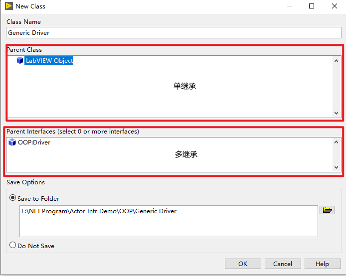
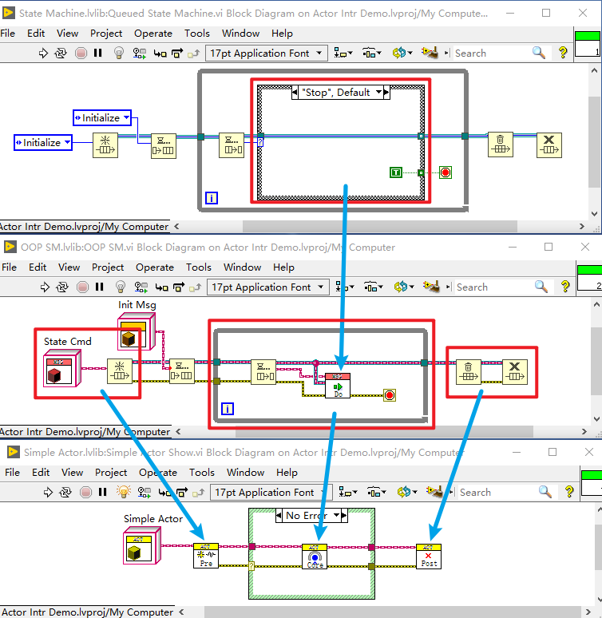

# Labview Actor Framework 详解及应用

当前 Labview 国内的学习资料除了 NI 的论坛，其他地方确实很少能找到，大部分的书籍都是关于基础编程的教程，我没有一天正经的学过 labview，最开始就是天天业余时间在公司部门实验室捣鼓机器，分析修改公司的测试软件的代码，到后来有机会独立出差部署调试设备，而这之前基本没有编程经验，学校计算机课都是混过去的。编程需要在实际中操作，做出一个项目，编程的基本技能和编程语言基本就熟悉了。

我将要写的系列基于Labview Actor Framwork 原理及应用的系列文章需要有基础的 labview 编程能力和面向对象的基础知识。本着互联网的开放原则，文章中所有源代码都将放到个人[github](https://github.com/20087843)上（Labview 需要更新到 2020 版本）。

------

[TOC]

## 1、Labview 及 Actor Framework 简介

2012年还没毕业就被韩国的汽车零部件大公司现代集团下的现代摩比斯汽车零部件天津工厂，当时人事部长问我想不想进质量部门，我说我只想搞技术，于是如愿以偿的进入了技术部门，最开始做了一年的产品，在做产品的过程中接触到各种设备，当时的领导对我的管理比较宽松，实验室有各种设备随便捣鼓，从那时后开始接触到 Labview。虽然在学校接触过编程，可从来没有弄明白过，接触了一段时间的labiew之后才慢慢理解了C语言中的数据类型和指针。

在我接触的编程语言中，Labview应该是最容易入门的编程语言了，图形化是人们最容易理解和接触的一种方式。通过 labview 之后学习 C 语言变得容易很多了，后面又通过 C 语言的经历，学习了 JAVA ，在互联网行业里又待了几年。现在又戏剧化的回到了电子自动化测试行业。

Labview 是美国 NI 公司原来主要用于编写测试程序的语言和平台，简单易学。最近一段时间做了一个项目，才发现 Labview 居然也又面向对象的语言特性，于是一边学习一边做项目，花了将近一个月的时间将之前用QDSM(Queue-Driven State Machine 队列消息驱动状态机模型)写的测试框架推倒用AF(Actor Framework)全部重写。

不过 Labview 的重点主要还是用于上位机的开发，做控制界面和控制流程，底层驱动多用 C语言开发，通过 Call Library Function Node 方法调用，复杂的测试分析用 Matlab 和 Python 开发应该会快速优雅一些。

说了这么多，总结一下：

1. labview 是 NI 公司开发的专注于测试的简单易上手的 G 语言程序开发语言，不过 Labview 现在也在不断扩展，可以用来做Web、嵌入式等的多种场景的开发。

2. Labview 兼容 C/C++，.NET，Python，Matlab等语言。

3. Actor Framework 框架是基于 QDSM 进行封装的一个状态机框架，一个Actor其实就是一个状态机。

   

## 2、Labview 及 Actor Framework 参考资料

刚接触 Labview AF 是通过李时珍知乎专栏[面向对象编程技术之接口类型学习资料汇总](https://www.zhihu.com/people/labats/posts?page=1 )了解到汤姆.麦奎兰（Tom McQuillan）的关于 [Actor Framwork 实例视频](https://www.bilibili.com/video/BV1AJ41177dJ)，将视频看了好几遍，然后上 NI 论坛查找了一些技术资料。所有参考资料如下：

1. [李时珍知乎专栏](https://www.zhihu.com/column/c_1184455161036099584)

2. [Tom's LabVIEW oop 系列](https://www.bilibili.com/video/BV1mf4y1y7ZE)

3. [Tom’s LabVIEW Adventure](https://www.bilibili.com/video/BV1AJ41177dJ)

4. [labview 操作者框架](https://blog.csdn.net/u011520129/article/details/51628175)（Labview 自带模板中有示例)

   
   
5. [LabVIEW Object-Oriented Design Patterns](https://forums.ni.com/t5/LabVIEW-Development-Best/LabVIEW-Object-Oriented-Design-Patterns/ba-p/3485576?profile.language=zh-CN)（不好意思，Ppt 忘了在哪下载的，找不到链接了)

6. Basic Object-Oriented Design Patterns Technical Manual and Exercises(不好意思，找不到原文链接了，只有本地文件和程序)

7. [LabVIEW OOP Design Patters](https://github.com/FloresFelipe/LabVIEW-OOP-Design-Patterns)

8. [中大型LABVIEW软件三层设计架构](https://wenku.baidu.com/view/31d45c155f0e7cd1842536c2.html)

以上都是比较高级的教程了，需要有一定的基础，最好的参考资料还是NI的帮助文档和论坛。我将要写的一系列文章尽可能详细的由简单到深入的一步步对Actor Framework 框架进行分析讲解。

## 3、Labview 值传递和引用传递

Labview 数据类型分为基本数据类型和引用类型，基本数据类型就相当与C语言中的存放于栈区的变量，引用类型就相当于指针指向存放于堆区的数据。引用又包括控件类引用和数据引用。控件类引用称之为 VI Server Reference，数据引用称之为 Data Value Reference。VI Server Reference 由 labview 自动管理， Data Value Reference 由用户（编程人员）自行创建和销毁。Labview 中队列和通知即是数据类引用，是在异步调用传递数据的重要工具，需要的时候也可以自行创建数据引用。

## 4、Labview 设计模式

### 4.1、SSM 简单状态机（Simple State Machine）

Labview 状态机实际上就是一个基于条件结构基础程序：

程序很简单，一个循环结构嵌套一个分支结构加一个循环寄存器，给定初始状态 “Initialize”，然后在当前状态执行的时候给定下一次状态，最后需要有一个“Stop”状态推出循环。

### 4.2、QDSM 消息驱动状态机(Queue Drived State Machine)

QDSM 是在 SSM 的基础之上将循环寄存器换成了队列，这样有什么好处呢？

寄存器是基于循环结构的，将上一次的数据传递到下一次循环，队列跟循环结构无关，右键点击队列连线选择“create control"，会发现创建的是一个数据引用（Data Refnum），什么意思？数据引用是保存在内存中的，Obtain Queue 其实就是 Memory Control 中的 New Data Value Reference，就是入栈和出栈是在内存中存取数据，队列方便了在线程之间传递数据，如此就引出了下面的消费者和生产这模式。 

### 4.3、P/C 生产者消费者模式(Produce & Customer)

生产者消费者模式，及一个线程生产数据，一个线程消费数据，其实这里已经涉及到下面要讲的简单多线程了，其实就是两个循环结构。

上边一个循环中有一个事件结构，主要用于响应按钮事件写入队列下面状态机的状态数据，状态机从队列中取出状态数据并执行对应状态分支。状态机引出一个错误簇是为了保证队列时序，保证下一个循环结束之后再销毁队列。

## 5、Labview 多线程及异步调用

### 5.1、简单 while 多线程

上面的消费者生产者模式中两个循环就是两个线程，这里就不不再多写。

### 5.2、while 封装多线程

这里的封装，不是面向对象中的封装，值是简单的将一个 while 线程包装成一个 VI，这一步的目的其实是为了引出下面的异步调用。

### 5.3、Start Asynchronous Call 异步调用

Start Asynchronous Call (异步调用) 其实跟直接调用 VI 的方式是一样的，唯一不同的是异步调用不需要等待VI执行完成即返回，及不会在VI调用上发生阻塞，这样我们可以在一个循环里启用多个线程，实现了 Msg Handler.vi 的复用。异步调用是实现 Actor 复用的重要实现方式。

## 6、Labview 面向对象

本节只是对 labview 面向对象做简单的入门梳理，关于LV OOP的应用可以参看 [LabVIEW OOP Design Patters](https://github.com/FloresFelipe/LabVIEW-OOP-Design-Patterns)，里面都是对 LV OOP 的经典应用。

### 6.1、库

labview 中的库相当于labview 中的包，python中的 module，便于大型项目的模块化分割和协同开发。库可以用来模块化封装，通过暴露公共接口对外提供 API。

### 6.2、接口

在 Project Explore 项目下文件夹或库目录上右键及可以创建接口 Interface 和类 Class。

Labview 的接口没有任何成员变量，只包含有VI。父类接口和类包含有动态VI和静态VI，动态VI可以被子类继承，静态VI不可以被子类继承。继承接口的第一级子类必须重写接口中的动态VI。

### 6.3、类

跟 Java 一样，labview 的类只能单继承，接口可以多继承。类的继承可以在创建类的时候指定，如下：

也可以在类创建好之后，在类名右键选择 Properties 修改类的继承关系：

不过 labview 的类没有构造函数和析构函数，类的初始化可以提供初始化的VI或者通过属性VI。在labview 中类不能被重构，只包含有私有属性，如果需要公共属性，labview 中提供了Global Variable(全局变量)：

### 6.4、对象

对象的创建有两种方式，一种静态调用和一种动态调用。静态调用很简单，跟控件的调用方法一样，就相当于一个常量，可以在函数面板中点击 Select a VI：

也可以在 Project Explore 窗口选中需要创建对象的类拖拽到程序框图中：

对象的动态创建：

动态方式创建对象，方便对象通过配置化来创建和管理，可以像 java 中 Spring IOC 一样对对象的容器化管理。例如一个工厂内不同的生产线使用不同的硬件，测试程序部署到新的生产线时，不需更改代码，只需要重新配置硬件驱动及其初始化参数。

### 6.5、作用域修饰

  Labiew 类和VI的作用范围包括四种：Public，Community，Protected，Private

  

  1. Public： 公共作用域，即在整个项目中都可以访问。Public 是 labview 的默认作用域
     
     2. Community：社区作用域，相当于 Java 中的 Default。社区包括库、类和接口，只有当前社区和其友元类才能访问
  3. Protected：Protected 只有 VI 并且是父类的 VI 才有的作用域，表示只有当前类和子类才可以访问的 VI
     4. Private：Private 即私有作用域，只有当前库或类才能访问

     

### 6.6、多态

Labview 的多态最直接的体现是在类VI的接线端上，当前类的对象接线端为星号，静态VI的接线端为方块。

动态VI和静态VI通过改变接线端可以互相转换：

labview 中的多态及动态VI，父类VI根据传入的不同子类对象动态调用相应对象的相应VI。

## 7、Actor Framework 分析

### 7.1、消息驱动状态机封装

先简单的将每一个状态及其消息封装成一个对象，演示如下(注意观察下方窗口右边 State Cmd 的变化)：

在演示程序中，没有了条件结构，取而代之的是一个Do.vi，Do.vi 是类 State Cmd 类的一个动态 VI，根据传入的State Cmd 的实际类型动态调用相应子类的 Do.vi。

### 7.2、Smiple Actor

上面的例子已经完成了 Actor 的第一步，将消息进行封装，Actor 的第二部就是对循环结构进行封装。

上面就是一个简单的 Actor，Labview Actor Framework 基本原理和架构就是 Simple Actor 的进一步封装和优化。从 QDSM 到 Simple Actor 就是将 Labview 编程从面向过程到面向对象的过程，利用对对象的多态代替分支结构，将循环结构抽象成 Actor  类，使开发人员只用专注于业务，减少不必要的重复代码。代码及架构的演化如下：

### 7.3、Root Actor 简单示例

Actor 的基本原理已经基本解释，下面主要开始对 Labview Actor Framework 的源码进行解析。先写一个简单的 Actor 示例

1. 创建 Actor，lvlib或文件夹右键选择 Actor 弹出创建 Actor 创建界面（养成良好习惯按类别分文件夹保存文件，保存之前确定保存位置是否正确）

   

2. 创建功能VI及其Msg，功能VI参数一定要先添加到接线端

   

3. 重写 Actor Core.vi，发送 Actor 消息

   

4. 发送停止消息

   

5. 启动 Actor

   

   到这里，一个简单的 Actor 及其功能已经实现了。一下是运行效果：

   

### 7.4、Actor 启动及消息分析

1. Actor 启动及生命周期

   

   Launch Actor Core.vi 异步调用 Actor.vi  > Actor.vi 创建并绑定消息队列到Actor对象 > Actor.vi 调用 Pre Launch Init.vi 初始化 Actor 对象 > Actor.vi 调用Actor Core.vi 循环接收并处理消息 > Actor Core.vi 接受停止消息生成停止错误 > Handle Error.vi 生成停止信号 >  Actor Core.vi 收到停止信号推出循环，到此一个 Actor 的生命周期结束。

   红色向下箭头标记的 VI 表示用户可以重写的 VI：

   - Pre Launch Init.vi : Actor Core.vi 调用之前的初始化
   - Actor Core.vi : 接受并处理用户消息，通常作为用户界面处理用户消息
   - Handle Error.vi : 错误处理，例如处理并清除用户错误使程序不会因异常而退出
   - Stop Core.vi : Actor Core.vi 循环停止之后的处理，例如 Actor 中用到的一些资源的销毁 (指向其实不对，这里只是表示说明一下在此VI调用处理 Stop Core.vi)

2. Actor 消息传递

   

   Actor.vi 生成消息队列后就可以开始向 Actor 发送消息，Actor Core.vi 启动后有消息即处理消息，没有消息即等待消息，直到 Actor Core.vi 的循环结束。

### 7.5、Root Actor WIth UI Event

通常一个 Actor 需要相应用户界面，以及通过界面控件进行流程控制，下面演示一个带 UI 的 Actor。

UI Actor 类重写了Pre Launch Init.vi、Actor Core.vi、Stop Core.vi，在Pre Launch Init.vi 中创建并绑定了停止事件和 Rcv 控件的 Rcv 事件，在Stop Core.vi 中对通知事件进行了释放。

用户点击 send 控件发送了Tx Content 消息，Actor Core.vi 接收到消息后调用 Tx Content.vi，Tx Content.vi 生成 Rcv 事件，事件结构捕捉到 Rcv 事件更新 Rcv 控件的值。

用户点击 Stop 控件或者关闭窗口事发送了停止消息，Actor Core.vi 消息处理循环停止后调用 Stop Core.vi，Stop Core.vi 中生成 stop 事件，事件结构接收到 stop 事件后退出事件循环，Actor Core.vi 的生命周期终止。

### 7.6、Nested Actor 简单示例

从动图可以看到，在 Root Actor 界面点击 Launch，每点击一次启动了一个 Nested Actor 界面，并且每一个界面都是独立运行的。前面介绍了异步调用，在 Launch Root Actor.vi 中也提到了，也就是异步调用使 Nested Actor 的多个独立界面成为了可能。异步调用即使一个线程启动器，每调用一个 Actor Core.vi 就是一个线程。 

### 7.7、Nested Actor 启动

Nested Actor 与 Root Actor 唯一不同的地方在于启动方式，Root Actor 使用 Launch Root Actor.vi，Nested Actor 使用 Launch Nested Actor.vi

从图中可以看到，Actor Core 的启动都是调用的 Launch Actor Core.vi，不同的地方在于 Root Actor 的 Caller Enqueue 给的是一个常量，Nested Actor 的 Caller Enqueue 是获取了 Caller Actor 的 Message Enqueue。还有就是 Nested Actor 启动后将 Nested Actor 的 Message Enqueue 绑定到了 Root Actor 上，这样有生么意义呢？注意到 Launch Root Actor.vi 的输入参数 Auto Stop?。是的，就是用于在 Root Actor 停止的时候是否自动停止 Nested Actor。

在 Stop Core.vi 中给所有的 Nested Actor 发送了一个停止消息，然后清空了Nested Actors。

### 7.8、Nested Actor 发送 Last Ack 消息

在Nested Actor 结构中有三种类型的消息，第一种跟 Root Actor 一样自己给自己发消息；第二种 Caller Actor 给 Nested Actor 发消息，也就使本例中 Root Actor 给 Nested Actor 发消息；第三种，Nested Actor 给 Caller Actor 发消息，即本例中 Nested Actor 给 Root Actor 发消息。其实还有一种，Nested Actor 给 Nested Actor 发消息，不过在 Actor Framework 框架中不建议同级之间的 Nested Actor 互相发消息，二十通过曲折的方式，先用第三种，Nested Actor 发送消息给 Caller Actor，然后使用第二种，Caller Actor 消息下发。

所有消息的传递同 Root Actor 中介绍的都是一样的，消息入队列，在 Actor Core.vi 消息处理循环中从队列中取出消息然后进行处理。所以第二中 Caller Actor 给 Nested Actor 发消息跟第一种是一样的，只是 Message Enqueue 需要换成 Nested Actor 的Message Enqueue。如果明白了 Nested Actor 停止消息的发送，就明白了 Nested Actor 的消息发送。只是 Caller 维护了一组 Nested Actors 但是它是 Private 的，专用于Nested Actor 的停止消息发送，继承的 Actor 中不可访问，需要用户自己维护一组 Nested Actor 的 Message Enqueue，维护方法可以参看 Record Nested.vi。 

第三中方式，Nested Actor 给 Caller Actor 发消息。先说一下 Last Ack。

上图 Actor.vi 中，Actor Core.vi 退出后，调用了 Send Last Ack.vi，参数 Message Enqueuer 传入的是 Caller Enqueuer。Last Ack 就是 Nested Actor 退出前给 Caller Actor 发送的消息，告诉 Caller Actor 我退出了，并且将错误簇、当前 Nested Actor 对象、当前 Nested Actor 对象的 Message Enqueue 绑定的了 Lask Ask 对象。看一下 Actor 类中对 Last Ack 的处理：

Caller Actor 收到Last Ack 之后删除了发送 Last Ack 消息的 Nested Actor 对象的 Message Enqueue。

以上就是Nested Actor 给 Caller Actor 发消息以及 Caller Actor 处理的全过程。

### 7.9、Nested Actor 发送 Caller Actor 消息

上面 Nested Actor 给 Caller Actor 发送消息有一个弊端（参看视频 [Tom’s LabVIEW Adventure](https://www.bilibili.com/video/BV1AJ41177dJ) 第9节）。如果 Lask Ack 换成用户自定义的消息，会发现 Nested Actor 模块中使用了 Caller Actor 模块中的 Message 类。

面向对象程序中有一条“高内聚，低耦合”原则，简单解释就是，底层模块尽量不要对上层模块产生依赖关系，保证底层模块的独立性和可移植性（更详细的解释参考 [浅谈高内聚低耦合](https://zhuanlan.zhihu.com/p/27468243)）。所以为了解除 Nested Actor 对 Caller Actor 的依赖关系，Nested Actor 给 Caller Actor 发消息推荐使用抽象消息 Abstract Message。

**第一步，给 Nested Actor 创建 Abstract Message**

注意最右边的窗口，创建 Abstract Massage 最好使用模板 VI 的方法，不容易出错，并且可以依赖插件完全自动化生成，还有Abstract Message 的名字最好跟模板VI一致，最好避免 Send 、Msg、Message 这类关键字 （看了Tom的视频后就会懂的，我最开始就是被Tom 视频中各种各样的名字搞蒙了）。

回到模板VI Tx Root Content.vi 调用刚刚生成的 Tx Root Content Msg 的 Send Tx Root Content Msg.vi。注意传入参数红色框框中的 Tx Root Content Msg 和 Caller Enqueuer。

**第二步，在 Root Actor(Caller Actor) 创建 Child Message**

同样先创建模板VI Rcv Nested Content.vi，创建 Tx Root Contesnt Msg 类的子类。收到消息后对消息的处理用户可以自定义，下图是示例程序中的处理。将接收到的 Content 生成 Rcv 事件。

**第三步，绑定 Root Actor(Caller Actor) 的 Rcv Nested Content Msg 到 Nested Actor 对象**

注意到右侧红框中跟 Record Nested.vi 中一样将 Nested Actor 绑定到 Caller Actor 对象的程序框图（不明白 AF 框架为什么不提供 Nested Actor 的访问VI）。

## 8、Actor Framework 应用

### 8.1、基于Actor Framwork 的 logging 框架

Logging 框架基于 Actor Framework，Logger Manager 是 Logging 框架的 Root Actor，Generic Logger 也是一个Actor，所有 Logger 实现需继承 Generic Logger，在 Init Loggers.vi 中根据 Logger 类名搜索项目下的 XXX Logger.lvclass 文件并实例化和初始化。

模块中用到了一个 Logger Manager 的全局变量，是为了实现其他模块对 Logging 模块的解耦，简化了 Log.vi 的调用。

项目源码在 [github](https://github.com/20087843/LV_Logging_Frame) 下载。

### 8.2、Actor 命令模式封装

Generic Actor 模块中已经封装好了常用的消息，用户不用生成各种各样的消息，消息类型太多不便于管理，只用关注与业务有关的 Cmd 开发。

项目代码下载路径 [github](https://github.com/20087843/LV_Cmd_Actor)。

## 9、自动化测试深入及拓展

自动化测试领域，Labview 只是最基础的工具，并且主要用于测试界面的开发。如果需要深入，还需要涉及到硬件、通信、测试分析。

硬件包括硬件和驱动，驱动又涉及到 C/C++ 程序的开发。

通信又包括串口，TCP，CAN，KLine 等多种通信协议和接口。

测试分析主要涉及的是测试数据的分析，从简单的开关电路测试到复杂的波形信号测试。信号的分析学会Matlab和Python编程会有很大的帮助。

虽然 Labview 测试界面开发简单快速，但是之适合向网页一样复杂度并不是太高的界面开发，如果对界面样式的需求比较高，建议使用 C++ 或者 C#。

如果开发大型模块化的程序，最好是熟悉面向对象编程的设计模式，以设计出合理的框架。

所以熟练 Labview 也只是相当于测试行业的入门，如果要成为大神还需要横向多方面的学习发展。